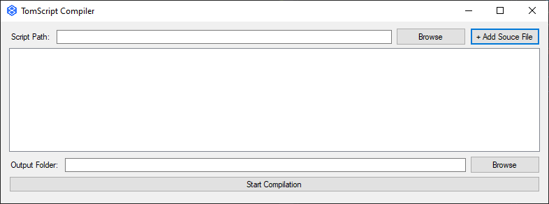

# Welcome to TomScript
#### A completely useless yet undeniably awesome programming language.

This language was created as an extremely high-level programming language suitable for anyone to learn! Originally started as a joke, we have been able to create a fully-functioning coding language for all to enjoy!
TomScript code is compiled using a custom C# compiler into Python.

## Features

- Console printing
- Variable declaration
- Simple and human-readable syntax
- Effortless build configuration

## How to use TomScript

Using TomScript is simple! Simply create a `.tms` file containing your code, and run the compiler!

## System Requirements

- Windows 7 or newer
- .NET Framework 4.8 for compilation of scripts
- Python 3.x for execution of scripts

## Basic syntax

Every TomScript program is structured in the following way:
    
    code properties

    start

    // code
    
    end

As you can see, the "start" and "end" syntax signals to the compiler the start and end of the code.

## Code Properties

TomScript currently has one property that can be changed on a script-by-script basis.

    language {language}

This changes the language subset used in the code. Each language subset contains different words for each command.
Currently, these languages exist:

    standard
    friendly
    fancy

The default languge is `standard`, and this will be used in the documentation here on out.

### Creating a variable

Creating a variable is simple! Use the "create variable" syntax, as follows:

    create variable name

Want to set a default value? Just use:

    create variable name and set name to Steve

### Combining commands

As you can see from the example above, commands can be combined with the command `and`, which may vary across language subsets.

    write Welcome to TomScript! and set input to read

### Setting a variable

Want to change the value of a variable during your program? That's easy:

    set name to Jim

TomScript automatically detects the value of the variable from a set statement. This means you'll need to set a default value in order to use numbers in calculations or loops.

### Calculating values

The new compiler does not yet support calculations, I'm working on it - gimme a few days.

### Printing to screen

Printing to the screen is called using the "write" syntax. Simply type "write" followed by the string, integer or variable you wish to print.

    write Hello, world!

    write So, you are called name?

### Reading user input

To read input from the user, simply use the `read` command, as shown:

    set variablename to read

### Comments

Commenting your code allows for inline explanations, and it's easy in TomScript; simply precede your comment with two forward slashes:

    set numTwo to 13 // Set the value of the second number
    // Oh look, they can be on their own line, too!

### Loops

A forever loop will execute the code inside of it continually:

    repeat forever

    // code

    stop

Don't want an endless loop? TomScript has you covered with another loop:

    repeat 10 times

    // code

    stop

Remember, you can replace `10` with any integer variable you like.

## Compiler UI

The new compiler comes with a slick new UI.

TomScript files can be added by pasting the path of one at the top of the program, or by using the browse button. You'll need to click `+ Add Source File` for the file to be added to the queue. Alternatively, select multiple files with the browse button and they will be automatically added.

The centre of the program shows the queue of files to process, with checkboxes in case you'd like to only compile certain files that you've added.

Beneath this is the output directory text box, complete with browse button.

Finally, the compile button lets you compile the checked scripts.

Any questions? Feel free to create an issue or fork the repo and fix it yourself!
